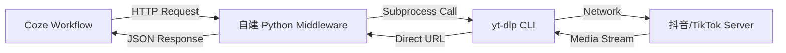

这是为您整合好的完整技术需求文档。您可以直接点击右上角的“复制”按钮，将这段 Markdown 代码发送给您的 Vibe Coding 助手（或 Cursor/Windsurf）。

```markdown
# 🚀 技术需求文档：Notey V2.0 抖音解析中间件 (Middleware) 实施计划

## 1. 项目背景与目标 (Context & Goal)
目前 Notey V1.0 的工作流依赖于 Coze 平台上的第三方插件来解析抖音/TikTok 分享链接。由于第三方插件存在稳定性风险（反爬失效、开发者弃坑），我们需要在 V2.0 阶段搭建一套**自托管的解析服务**作为兜底方案。

**核心目标**：
构建一个轻量级的中间件服务，作为 Coze 与底层解析工具 (`yt-dlp`) 之间的桥梁，实现对抖音视频音频直链的提取。

## 2. 系统架构 (System Architecture)

我们需要采用**“Wrapper Pattern (包装器模式)”**来实现该服务，以确保未来迁移至商用 API 时无需修改客户端代码。

**数据流向：**
1.  **Input**: Coze 工作流发起 HTTP GET 请求（携带抖音分享 URL）。
2.  **Processing**: 中间件服务接收请求，并在服务器端调用 `yt-dlp` 命令行工具。
3.  **Core Logic**: `yt-dlp` 解析目标 URL，提取音频流的直链 (Direct URL)。
4.  **Output**: 中间件将直链封装为标准 JSON 格式返回给 Coze。



## 3. 技术栈规范 (Tech Stack)

请基于以下技术栈生成项目代码：

* **语言**: Python 3.9+
* **Web 框架**: FastAPI (要求异步处理，高性能)
* **解析核心**: `yt-dlp` (需通过 subprocess 调用)
* **部署环境**: Docker (基于 `python:slim` 镜像，需预装 `ffmpeg`)

## 4. 功能需求细则 (Functional Requirements)

请实现一个满足以下标准的 API 服务：

### 4.1 接口定义

* **Endpoint**: `/extract_audio`
* **Method**: `GET`
* **Parameters**: `url` (String, 必填, 抖音/TikTok 的分享链接)

### 4.2 核心逻辑要求

1. **速度优先**：不要下载完整的视频或音频文件到服务器。
2. **命令参数**：请使用 `yt-dlp -g` (get-url) 模式，配合 `-f bestaudio/best` 参数，仅获取直链地址。
3. **错误处理**：
* 若 `yt-dlp` 执行超时（建议设置 30s 阈值），需返回 504 错误。
* 若解析失败（链接无效或被风控），需返回包含具体错误信息的 JSON。


### 4.3 响应格式 (JSON)

成功时返回：

```json
{
  "status": "success",
  "data": {
    "audio_url": "[https://v3-dy-d.zjcdn.com/](https://v3-dy-d.zjcdn.com/)...",
    "original_url": "..."
  }
}

```

## 5. 部署与集成说明 (Deployment & Integration)

### 5.1 Docker 化

我们需要一个 `Dockerfile`，确保构建出的容器包含：

* Python 环境
* 系统级依赖 `ffmpeg` (yt-dlp 依赖项)
* 项目依赖 (`requirements.txt`)

### 5.2 Coze 集成策略

此服务部署后（预计部署在 Render/Railway），将在 Coze 中通过**“自定义插件”**方式接入。插件将替代原有的 `get_douyin_video_url` 节点。

## 6. 风险控制与扩展性 (Risk & Scalability)

* **IP 风控**：代码需预留代理配置接口（如支持通过环境变量 `PROXY_URL` 传递给 yt-dlp）。
* **未来迁移**：代码结构需保持解耦。Controller 层与 Service 层分离，以便未来将 `yt-dlp` 的实现逻辑替换为“商用 API 调用逻辑”时，无需修改 API 接口定义。

---

**请根据以上需求，生成完整的项目代码结构，包括 `main.py`, `requirements.txt` 和 `Dockerfile`。**

```

```